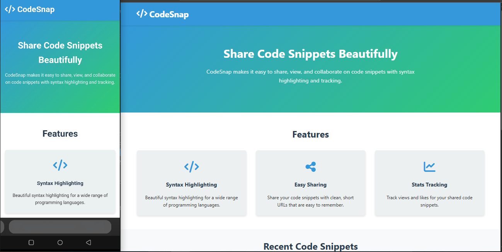

# CodeSnap

Aplikasi berbagi kode yang kece badai dengan tampilan yang ciamik dan fitur tracking.



## Struktur Proyek

```
project-root/
├── code/               # Folder untuk file-file kode
│   ├── example.js      # Contoh file JavaScript
│   ├── style.css       # Contoh file CSS
│   └── app.py          # Contoh file Python
├── data/               # Folder untuk file data
│   ├── config.json     # Metadata buat file kode
│   └── siteConfig.json # Konfigurasi website
├── public/             # File statis buat frontend
│   └── index.html      # Halaman utama frontend
├── server.js           # Aplikasi server utama
├── package.json        # Dependensi Node.js
├── vercel.json         # Konfigurasi untuk deploy di Vercel
└── README.md           # File ini
```

## Fitur Keren

- **UI Modern**: Desain bersih dan responsif yang works di semua perangkat
- **URL Pendek**: URL yang enak dibaca dan dishare (misalnya /abc123)
- **Syntax Highlighting**: Pemformatan kode yang cantik untuk berbagai bahasa pemrograman
- **Sinkronisasi Otomatis**: Otomatis mendeteksi file baru dan update config
- **Tracking Statistik**: Ngitung views dan likes untuk setiap snippet kode
- **Likes Sekali Aja**: User cuma bisa ngelike kode sekali (pakai IP dan localStorage)
- **Kopas Langsung**: Gampang copy kode dengan satu klik
- **Pengaturan Kustom**: Ganti nama website, tema, dan info kontak sesuai keinginan

## Endpoint API

- `GET /api/list` - Dapetin semua file kode dengan metadatanya
- `POST /api/like/:shortId` - Nambahin like ke file (sekali per user)
- `GET /:shortId` - Liat kode dengan syntax highlighting
- `GET /raw/:shortId` - Dapetin isi file mentah untuk di-copy
- `GET /api/site-config` - Dapetin konfigurasi website

## Cara Pasang

1. Pastikan punya [Node.js](https://nodejs.org/) (versi 14.x atau lebih tinggi)

2. Clone repository atau download filenya

3. Install dependensinya:
   ```
   npm install
   ```

4. Jalanin servernya:
   ```
   npm start
   ```

5. Buka browser dan kunjungi:
   ```
   http://localhost:3000
   ```

## Cara Deploy ke Vercel

1. Pastikan punya akun [Vercel](https://vercel.com)

2. Install Vercel CLI:
   ```
   npm install -g vercel
   ```

3. Login ke Vercel:
   ```
   vercel login
   ```

4. Deploy project:
   ```
   vercel
   ```

5. Ikuti aja instruksinya, terus tunggu sampai selesai!

## Cara Konfigurasi

### Konfigurasi Website

Kamu bisa kustomisasi tampilan dan info website dengan edit `data/siteConfig.json`:

```json
{
  "name": "CodeSnap",
  "description": "Share kode kamu dengan mudah dan kece",
  "author": "Nama Kamu",
  "contact": "email.kamu@example.com",
  "social": {
    "github": "https://github.com/usernamekamu",
    "twitter": "https://twitter.com/usernamekamu"
  },
  "theme": {
    "primary": "#3498db",
    "secondary": "#2ecc71"
  }
}
```

### Nambahin File Kode

Tinggal masukin file kode kamu ke folder `code/`. Server bakal otomatis deteksi file baru dan update config-nya.

## Cara Kerjanya

1. Pas file ditambahin ke folder `code/`, langsung otomatis kedeteksi dan ditambahin ke `config.json` dengan shortId unik
2. Halaman utama nampilin semua snippet kode yang ada, lengkap dengan info dan statistiknya
3. Setiap snippet kode punya URL sendiri pake shortId (misalnya /abc123)
4. Views dihitung setiap kali ada yang ngunjungin snippet kode
5. Likes dihitung sekali per user pake alamat IP dan localStorage

## Lisensi

Proyek ini open source, bebas dipake dan dimodifikasi sesuka hati.
